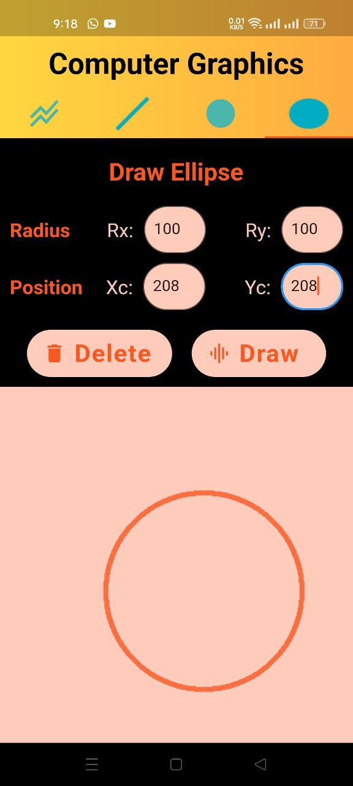
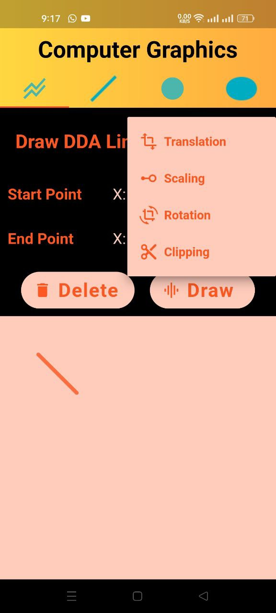
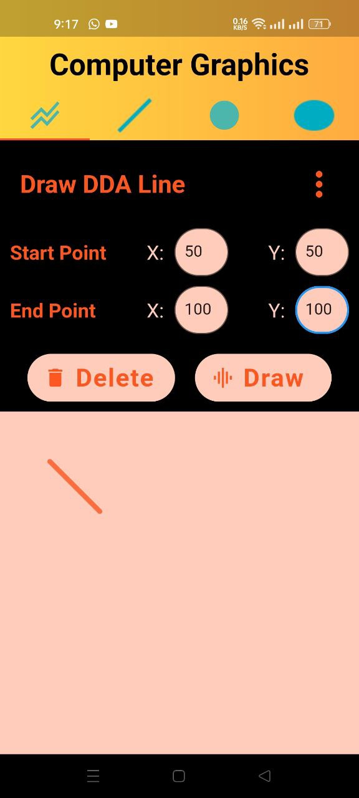
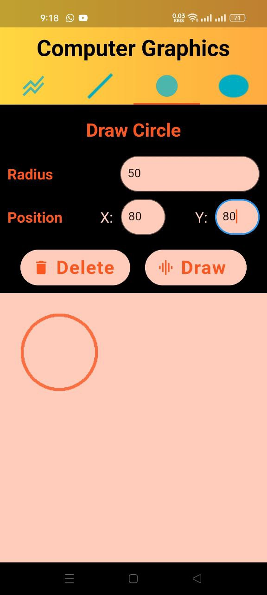

# Graphic

It is a project to test a graphic drawing using the mathematical equations that the computer and the mobile do, and here you will be able to try all the drawing that you like in a smart way

Developed by Eng : Mostafa Atta

# My accounts:
 
https://www.facebook.com/mostafa.atta.9085
 
https://www.linkedin.com/in/mostafa-3tta-5949581a2/
 

# Some photo about project:
 

 

 

 

